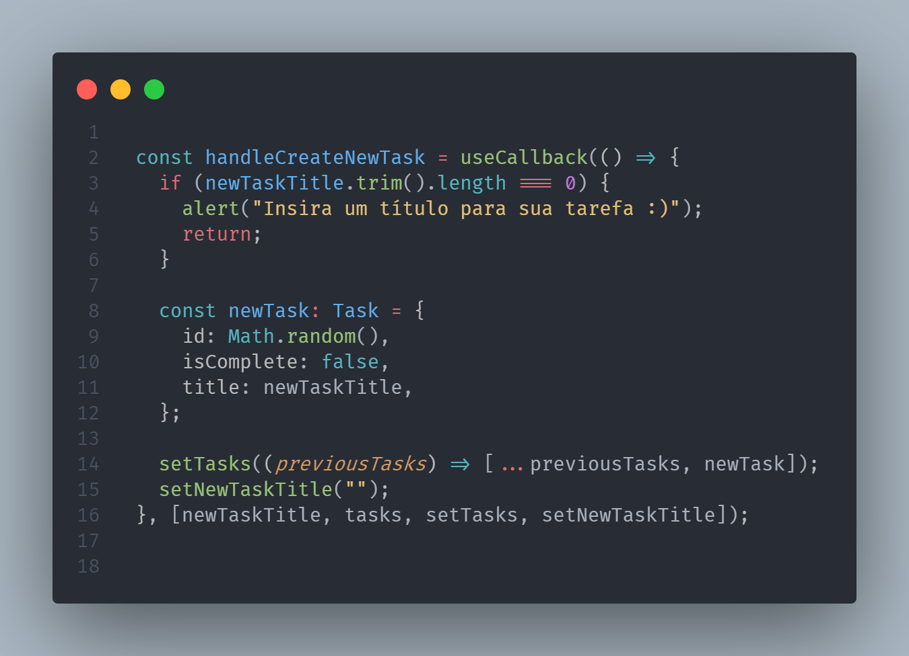
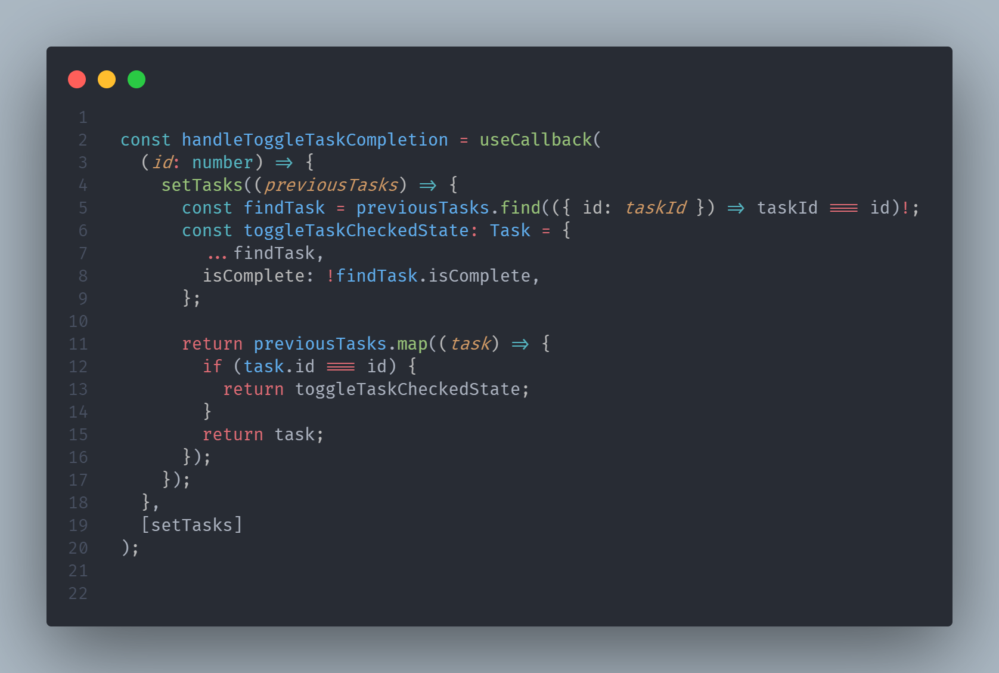
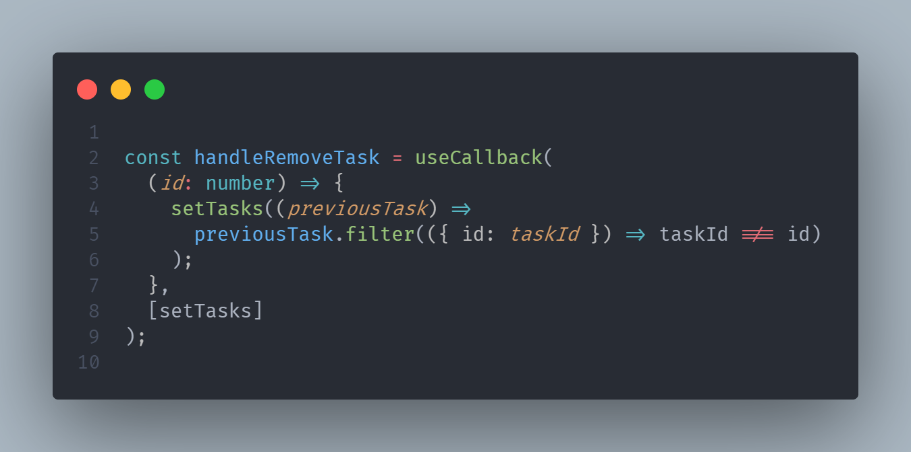

# ROCKETSEAT IGNITE 🚀

### REACTJS TRACK - CHALLENGE #01 💪

The goal of challenge is refactor code, implementing three functions. This functions are:

- Create a new task
- Toggle task checked state
- Remove task

My implementation to first functionality - Create a new task.

My implementation to second functionality - Toggle task checked state.

My implementation to third functionality - Remove task.

I wanted to use useCallback hook to memorize functions instantied
